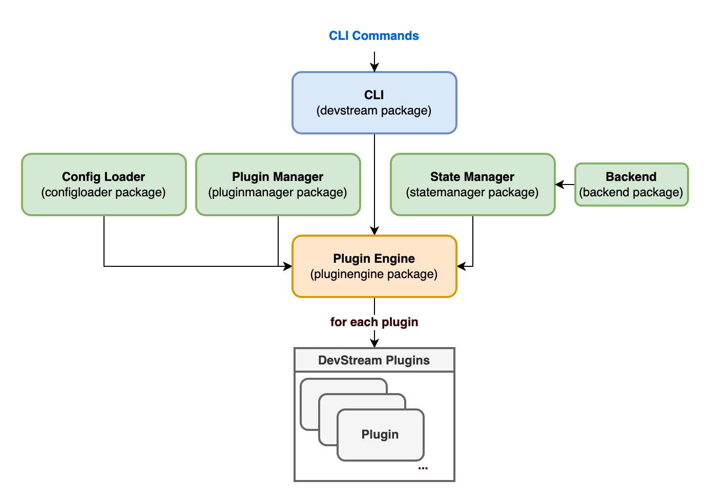

# Core Concepts Overview

Let's assume you're familiar with core Git, Docker, Kubernetes, Continuous Integratoin, Continuous Delivery, and GitOps concepts. These are the core concepts of DevStream.

## The Architecture of DevStream

The architecture image below shows how DevStream works in general:

## Config

DevStream defines your DevOps toolchain in config files.

The major part of the config file is definition of your DevOps _Tools_.

Each _Tool_ has its name, instanceID (unique identifier), and options for that tool.

Each _Tool_ can also have its dependencies, and can refer to other tool's output as values of its own options.

## State

The _State_ records the current status of your DevOps toolchain.

The state contains the configuration of each tool, and the current status.

## Resource

We call what the plugin created a _Resource_. It can be a installed DevOps tool, a configuration of a DevOps tool, an integration of different DevOps tools, etc.

## Workflow

